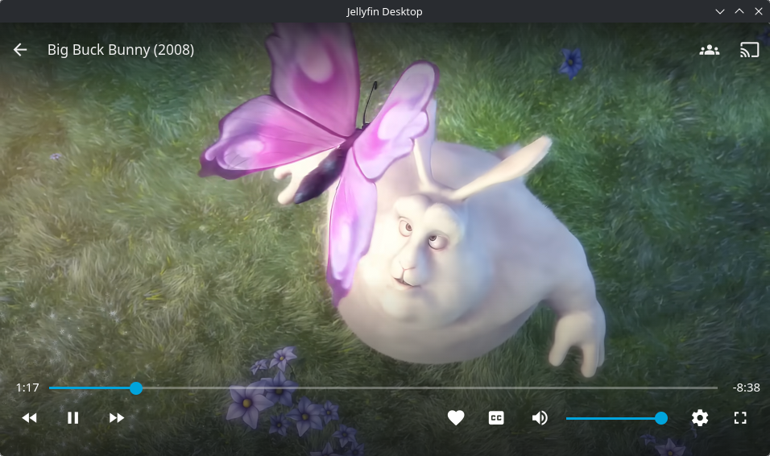

# Abyssfin

Abyssfin is a Jellyfin desktop client built on the Qt WebEngine + libmpv stack. It ships with built-in [Abyss](https://github.com/AumGupta/abyss-jellyfin) theme support and Picture-in-Picture (PiP) playback.



## Features

### Abyss Theme
- Automatically injects the Abyss dark theme into the Jellyfin web client
- Sets the Jellyfin base theme to Dark for correct Abyss rendering
- Optional custom Abyss CSS URL in client settings
- Abyss-styled server connection screen

### Picture-in-Picture
Based on [jellyfin-desktop-pip](https://github.com/jellyfin-archive/jellyfin-desktop-qt/pull/1193) for Jellyfin Desktop v1.12.0:
- `Ctrl+Shift+P` to toggle PiP
- `Escape` to exit PiP
- PiP toggle in the video player OSD
- Frameless, always-on-top PiP window with drag-to-move and edge resize
- Persists PiP size and position across sessions
- Automatically exits PiP when playback stops
- PiP tested on macOS and Windows; disabled on Linux/Wayland

### Jellyfin Desktop Features
- Native MPV playback with hardware decoding and audio passthrough
- Multi-server support
- Client-side settings
- Windows media integration and system tray

## Downloads

Build from source for now. See [dev/](dev/) for platform-specific build instructions.

## Abyss Theme Settings

Open **Client Settings** from the Jellyfin menu to configure:
- **Enable Abyss Theme** — on by default; disable if your server already applies Abyss via Custom CSS
- **Abyss Theme URL** — optional override for the CSS URL (defaults to the Abyss CDN)

## Building

See [dev/macos/README.md](dev/macos/README.md), [dev/windows/README.md](dev/windows/README.md), or [dev/appimage/](dev/appimage/) for platform build instructions.

```bash
mkdir build && cd build
cmake ..
cmake --build .
```

## File Locations

Data is stored per-profile in a `profiles/<profile-id>/` subdirectory. The main configuration file is `abyssfin.conf`.

**macOS:**
- Config: `~/Library/Application Support/Abyssfin/profiles/<profile-id>/`
- Cache: `~/Library/Caches/Abyssfin/profiles/<profile-id>/`
- Logs: `~/Library/Logs/Abyssfin/<profile-id>/`

**Windows:**
- Config: `%LOCALAPPDATA%\Abyssfin\profiles\<profile-id>\`
- Cache: `%LOCALAPPDATA%\Abyssfin\profiles\<profile-id>\`
- Logs: `%LOCALAPPDATA%\Abyssfin\profiles\<profile-id>\logs\`

**Linux:**
- Config: `~/.local/share/abyssfin/profiles/<profile-id>/`
- Cache: `~/.cache/abyssfin/profiles/<profile-id>/`
- Logs: `~/.local/share/abyssfin/profiles/<profile-id>/logs/`

## Credits

- [Jellyfin Desktop (Qt)](https://github.com/jellyfin-archive/jellyfin-desktop-qt) — base desktop client
- [jellyfin-desktop-pip](https://github.com/jellyfin-archive/jellyfin-desktop-qt/pull/1193) — PiP implementation
- [Abyss for Jellyfin](https://github.com/AumGupta/abyss-jellyfin) — theme by AumGupta

## License

GPL-2.0 — see [LICENSE](LICENSE)
